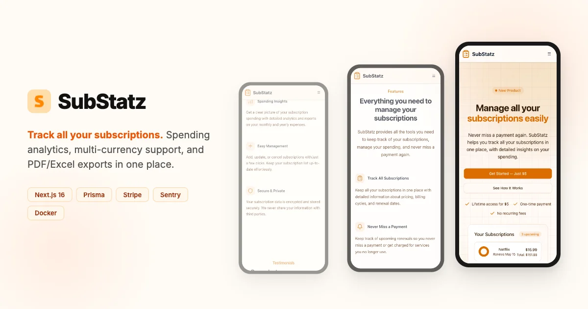

# SubStatz — Subscription Management Made Easy

> A full-stack subscription management app that helps users track spending, analyze costs across currencies, and never miss a renewal.

**[Live Demo](https://substatz.me)**



---

## What it does

- **Track subscriptions** — add, edit, and organize recurring payments with price history tracking over time
- **Spending analytics** — interactive charts and breakdowns by category, currency, and billing cycle (premium feature gated via Stripe)
- **Multi-currency support** — 10 currencies with automatic exchange rate syncing via external API + cron job
- **Export reports** — generate PDF and Excel subscription reports for offline use

## Architecture

```
src/
├── app/                          # Next.js App Router (route groups: auth, app)
│   ├── (auth)/                   # Login, register, password reset
│   ├── (app)/                    # Protected routes: dashboard, settings, admin
│   └── api/                      # Stripe webhook, cron jobs, health check
├── features/                     # Feature-based modules with strict isolation
│   ├── auth/                     # Authentication flows
│   ├── dashboard/                # Subscription CRUD + analytics
│   ├── settings/                 # User preferences
│   ├── landing-page/             # Marketing page with SEO
│   └── migration/                # Admin migration management
├── components/ui/                # ShadCN UI component library
└── lib/                          # Shared: Prisma client, Stripe, rate limiting, env validation
```

Each feature is fully isolated — no cross-feature imports. App routes only access features through public index files. This enforces clear boundaries and makes the codebase easy to navigate.

## Key technical decisions

- **Feature-based module isolation** — strict import boundaries between features, enforced by convention. Each feature owns its components, server actions, DB queries, and Zod schemas
- **Tiered server actions with `next-safe-action`** — base, `privateAction`, `publicAction`, `adminAction` wrappers that layer auth, rate limiting, and Sentry error capture
- **Subscription history as an append-only log** — price/currency/cycle changes are stored as `SubscriptionHistory` records with `effectiveFrom`/`effectiveTo` ranges, enabling full audit trail and historical analytics
- **Dynamic OG image generation** — server-rendered Open Graph images via `@vercel/og` with branded gradient design, no static assets needed
- **Type-safe environment validation** — `@t3-oss/env-nextjs` with Zod schemas ensuring all env vars are validated at build time

## Tech stack

| Layer | Technology |
|---|---|
| Framework | Next.js 16 (App Router, Turbopack, React Compiler) |
| Language | TypeScript (strict) |
| UI | React 19, Tailwind CSS 4, ShadCN UI, Recharts |
| Database | MySQL + Prisma ORM 7 |
| Auth | NextAuth.js (JWT) — Credentials + Google OAuth |
| Payments | Stripe (one-time payment for premium) |
| Validation | Zod + React Hook Form + next-safe-action |
| Email | Resend |
| Monitoring | Sentry |
| Infrastructure | Docker, Biome (lint + format) |

## Getting started

```bash
git clone https://github.com/jaqubowsky/substatz.git
cd substatz
npm install
cp .env.example .env        # fill in required values
npm run migrate:dev          # run Prisma migrations
npm run dev                  # start dev server (Turbopack)
```

Requires Node.js 22+ and a MySQL database.

## Author

**Jakub Nalewajk** — Frontend Developer

- Portfolio: [jnalewajk.me](https://jnalewajk.me)
- GitHub: [@jaqubowsky](https://github.com/jaqubowsky)
- LinkedIn: [jakub-nalewajk](https://www.linkedin.com/in/jakub-nalewajk/)
